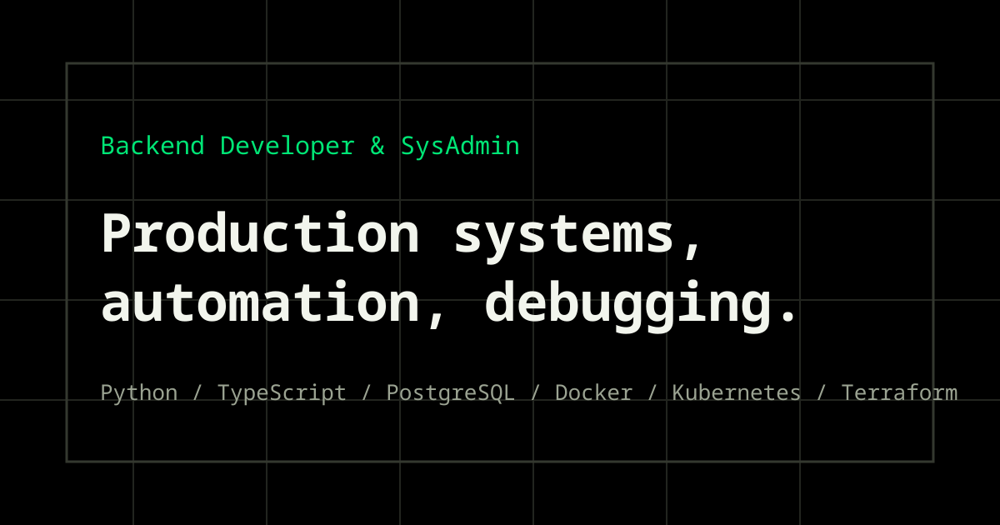
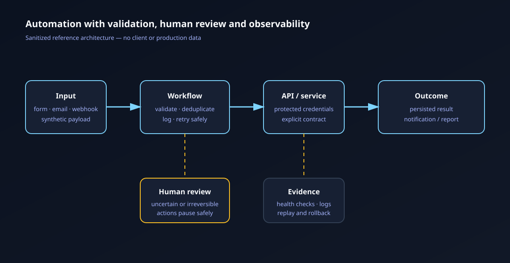
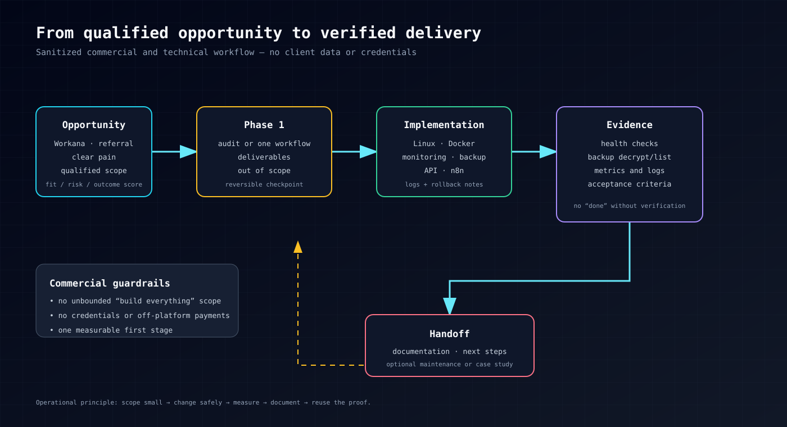

# Technical Infrastructure & Automation Portfolio

  

  <strong>Small, verifiable examples of Linux, Docker, backups, monitoring and workflow automation.</strong>

  <a href="https://lau.ar">Live portfolio</a> ·
  <a href="https://lau.ar/case-files/">Case files</a> ·
  <a href="https://github.com/LautaroFMartinez">GitHub profile</a>

> Sanitized demonstrations and laboratory work. These examples are not presented as client testimonials, employer credentials or production access.

## What this demonstrates

- Diagnosing infrastructure from evidence instead of guesswork.
- Deploying Docker services with safer defaults.
- Verifying that backups can actually be decrypted and listed.
- Monitoring containers, disk health and service availability.
- Building small n8n/API workflows with validation and human review.
- Turning an operational problem into a bounded, measurable delivery.
- Making the workflow observable and recoverable.

## Visual overview

### Automation and operations architecture

A request enters a workflow, is validated, calls an API, persists an outcome and sends an observable notification. Human review protects uncertain or irreversible actions.

### From opportunity to verified delivery

This is the commercial/technical loop behind the case studies: scope a small first stage, implement safely, verify with evidence and leave a useful handoff.

## Portfolio preview

The live portfolio contains the longer-form case files and experience context. The local assets below are intentionally sanitized so the repository remains useful without exposing private systems, credentials, internal identifiers or customer information.

- [Open the live portfolio](https://lau.ar)
- [Browse the live case files](https://lau.ar/case-files/)
- [Read the public production operations summary](cases/production-operations/README.md)

## Cases

- [Linux and Docker audit](cases/linux-docker-audit/README.md)
- [Backup verification](cases/backup-verification/README.md)
- [Monitoring and alerting](cases/monitoring-stack/README.md)
- [n8n and API automation](cases/n8n-api-automation/README.md)
- [E-commerce webhook reliability lab](cases/ecommerce-webhook-lab/README.md)
- [Production operations case studies](cases/production-operations/README.md)

## Evidence and verification

The examples are designed to be inspectable and runnable where practical:

- [Linux audit helper](cases/linux-docker-audit/audit.sh)
- [Backup verification script](cases/backup-verification/verify_archive.py)
- [Monitoring health check](cases/monitoring-stack/healthcheck.py)
- [Synthetic n8n/API payload](cases/n8n-api-automation/mock_payload.json)
- [Portfolio checks workflow](.github/workflows/portfolio-checks.yml)

The GitHub Actions check compiles the Python examples, validates JSON, checks shell syntax and rejects common secret-file patterns.

## Delivery principles

- Scope a small first stage.
- Back up state before risky changes.
- Keep secrets out of repositories.
- Add logs, health checks and rollback notes.
- Verify the result with reproducible evidence.
- Document unknowns instead of filling gaps with assumptions.
- Keep personal/lab work clearly separated from client or employer claims.

## Repository scope

This repository is the public, sanitized proof layer. The production portfolio at `lau.ar` is maintained in a separate private repository and is deployed independently. A case appearing here does not imply that private infrastructure or customer data is available in this repository.
